# GH-300 GitHub Copilot

## GitHub Copilot Labs

* https://github.com/MicrosoftLearning/mslearn-github-copilot-dev
* https://ghcertified.com/en

## Day 1 Session

### Certification Prep LevelUp

* aka.ms/On-DemandLevelUp
* https://skillupwithlevelup.com/certification-prep-on-demand?solution_areas=81034

### Lab Resources

* Lab link:	https://cloudweeks.learnondemand.net/Class/719908
* Lab key:	9769C925460C9C0E

## Introduction
* We are a software developer, familiar with Git and GitHub, and have some knowledge of AI.
* We want to integrate GitHub Copilot into our development workflows.
* How can we customize Copilot in GitHub to our needs?

## Understand Responsible AI Principles

* When you supply data to these AI tools, what happens to the data?
* There are 6 principles of AI that should be followed.

### Mitigate AI Risks

* You can very rapidly create code against some specification issued to Copilot.
    * Quickly test and deploy to production.
    * Leads to acceleration of release of business software for an organization.
* This version of Copilot is geared towards code generation, not the same Copilot that is available as a chat bot.
* While it is very capable, there is risk.
* We are using tools that are hosted by a third party (Microsoft) and these tools have a certain amount of randomness (hallucinations) and present it as legitimate.
    * And if the tool is not transparent, we don't know how the AI tool arrived at the solution.
* To mitigate risks, we want to implement `Governance Frameworks` to help manage our data and oversee our AI tools.

#### Principles of Responsible AI (Re. GitHub Copilot)

* `Fairness` - AI systems should treat all people fairly, avoiding differential impacts on similarly situated groups.
* `Reliability and Safety` - AI systems must operate reliably, safely, and consistently, minimizing unintended harm and perform as intended
* `Privacy and Security` - Protecting user privacy and data security is crucial, including consent, minimal data collection, anonymization, and strong encryption.
* `Inclusiveness` - AI systems should be accessible and empower everyone, ensuring they work well for diverse users and are available worldwide.
* `Transparency and Accountability` - AI systems must be understandable, with clear explanations, auditability, and continuous monitoring to ensure responsible operations.

## Introduction to GitHub Copilot

* GitHub Copilot can be used with Visual Studio Code, Visual Studio which presents a chat interface.
    * There are integrations with other development tools as well.
* `Copilot for Chat` - allows us to identify code errors and suggest fixes, allows us to generate unit tests.
    * Can also allow us to build an application from scratch
    * Any kind of programming task we can conceive of can be achieved with Copilot for Chat.
* `Copilot for Pull Requests` - You can open a copilot chat interface on GitHub directly.
    * Anything we do day in day out as developers through GitHub can be automated with copilot.
    * Integration suggested changes to code by using Copilot Workspace
    * Can review pull requests, can adjust the suggested descriptions for commits.
* `Copilot CLI` - Can work directly on the command line to chat with Copilot without having to use another application in which Copilot is integrated.

### Subscription Plans

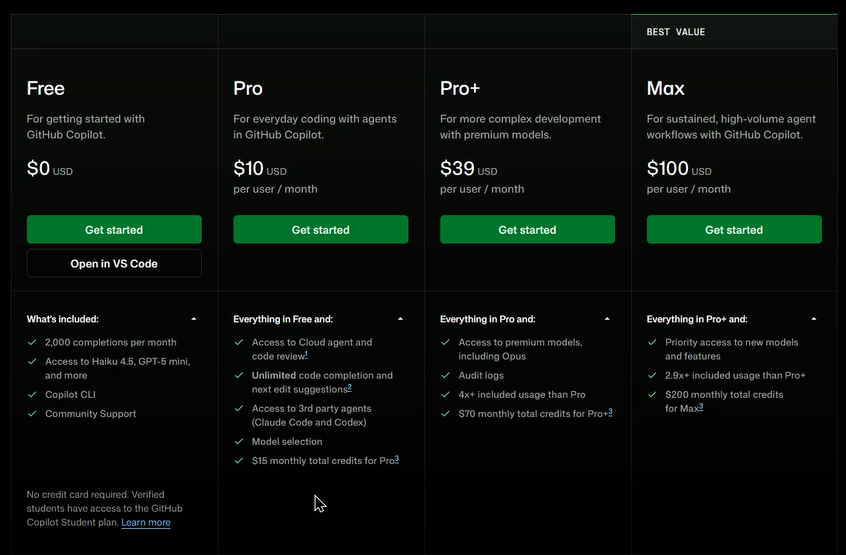

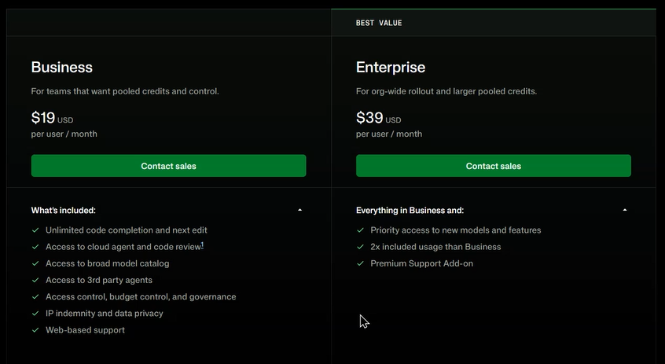

### Demo

* You can install GitHub Copilot as an extension in Visual Studio Code
* If you have a higher tier license, you need to authenticate against your GitHub account to get those features.
* Crtl-I allows us to provide a prompt to GitHub Copilot in Visual Studio Code that will allow us to use natural language to generate code in particular language
* We need to review the GitHub Copilot documentation to identify what features we can customize - how can we change the behavior of Copilot to work for us?

## Craft Effective Prompts

* `Prompt Engineering`
    * Craft clear instructions to guide AI systems like GitHub Copilot.
    * Ensures code is syntactically, functionally, and contextually correct.
    * Generates context-appropriate code tailored to project needs
* `Principles of Prompt Engineering`
    * Focus on a single, well-defined task or question for clarity.
    * Provide explicit and details instructions for precise code suggestions
    * Keep prompts concise to maintain clarity without overloading the AI.
* `Best Practices in Prompt Engineering`
    * Use descriptive filenames nad keep related files open for rich context.
    * `Iterate` - Refine prompts based on feedback to improve AI responses
    * `Contextualize` - Provide relevant background information to enhance code suggestions.
* `Advanced Strategies`
    * `Layered Prompts` - Break complex tasks into smaller, manageable prompts.
    * `Feedback Loop` - Continuously evaluate and adjust prompts for optimal performance.
    * `Collaborative Input` - Involve team members to ensure comprehensive and effective prompts.

## Engineer Prompts for Performance

* We have a limited number of credits (tokens) that we can use. If we cross, we will need to pay for more.

### GitHub Copilot user prompt process flow.

* `Inbound Flow`
    * We provide a prompt through a `Code Editor`
    * This travels to a `Prompt Server`
    * This server sends the prompt to a `Toxicity Filter` to determine if the prompt is ethical, safe, and can be evaluated.
    * The prompt is then sent to teh `LLM`, where it is tokenized and evaluated
* `Outbound Flow`
    * The `LLM` provides its response
    * This travels back to the outbound `Toxicity filter` to ensure the LLM hasn't provided an unsafe response.
        * This doesn't guarantee the correctness of the response.
    * The response travels to the `Proxy Server`
    * Finally it reaches the `Code Editor` from where we gave the prompt.

* You always want to start a new chat session when changing topics since the LLM will evaluate the entire chat history when addressing your question which will consume more tokens

### GitHub Copilot Data

* `Data Handling for Code Suggestions`
    * `No Retention` - once we get our response, GitHub Copilot discards prompts
    * `Opt-Out Option` - Individual subscribers can opt out of sharing their prompts for model fine-tuning
* `Data Handling for Copilot Chat`
    * `Response Formatting` - formats responses for optimal presentation, highlighting code snippets.
    * `User Engagement` - allows follow-up questions and maintains conversation history for context
    * `Data Retention` - retains prompts and suggestions for 28 days outside code editor

### Copilot LLMs

* LLMs are trained on vast amounts of text from diverse sources
* They generate contextually relevant and coherent text, making meaningful contributions to various forms of communication.
* LLMs are neural networks with millions or billions of parameters, fine tuned to understand and predict text effectively
* These models can be tailored for specialized tasks, making them highly versatile across different domains and languages

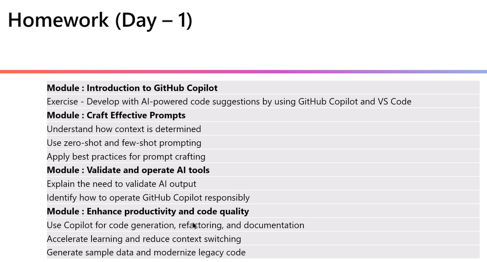

## Day 2 Session

### Module 5 - Using advanced GitHub Copilot features

* Work with a preconfigured GitHub repository in Codespaces with the GitHub Copilot extension
* Use interactive features of GitHub Copilot to generate useful suggestions for an existing project.
* Apply advanced GitHub Copilot features to learn more about a new project, write documentation, and create unit tests.

#### Advanced GitHub Copilot Features

* `Ghost Test Suggestions` - GirHub Copilot provides real-time code suggestions called ghost text, which you can accept with the Tab key or ignore
* `Contextual Prompts` - By default, Copilot uses open files as context but you can also provide prompts via comments, chat window, or inline chat
* `Interactive Chat` - Use the chat features in Visual Studio Code to ask questions about your code or other software related queries
* `Inline Chat`
* `Slash Commands` - Utilize slash commands in the chat pane or inline chat for quick solutions to common development tasks
* `Agents` - Use agents like `@terminal` and `@workspace` in Visual Studio Code to ask context-specific questions about your terminal or entire project.

#### Applied GitHub Copilot Techniques

* `Implicit Prompts`
    * GitHub Copilot includes features that implicitly provide a precrafted prompt to get a good answer.
    * Slash commands can be used both in the inline chat and the chat interface
* `Selective Context`
    * Workspace Suggestions - Customize copilot to provide suggestions based on the entire workspace or terminal output.
    * Contextual Assistance - Use agents like `@workspace` to get tailored suggestions for tasks like creating Docker files.
    * Use `@docker` to learn about containerization, for generating Docker assets for local development workflows, or analyzing project vulnerabilities
* `Combining Features`
    * Slash Commands and Inline Chat - Combine these features to interact with Copilot in the most effective way for your coding needs.
    * Flexible Interaction - Choose the method that works best for your and your code, whether it is inline chat or dedicated chat panes
* `Rewording Prompts`
    * Refining Requests - If initial suggestions aren't satisfactory, reword your prompts to be more specific.
    * Iterative Improvement - Continuously refine your prompts or start writing code for Copilot to autocomplete, ensuring better results.

#### Demo - GitHub Copilot Interactive Chat

* You have the ability to ask a question, create an issue, and invoke Spark.
* When you use the `@` annotation, you can trigger certain agents.

### Module 6 - Use GitHub Copilot in the IDE

#### Demo - GitHub Copilot in Visual Studio Code

* As you type, Copilot's ghosting technique gives you autocompletion suggestions, both comments and code.
* You can accept the suggestion by pressing the `TAB` button
* You can prompt GitHub Copilot in line to look at isolated lumps of code, and extend that code in various ways.
* You can have a code project open and use the chat feature to ask what the code does.
* You can use the `#` symbol to help GitHub Copilot to focus its attention to certain areas when answering your question
    * `#terminalLastCommand` will go to your terminal and will provide you information related to your last terminal command
    * `#codebase` will search through your entire codebase for an answer.
* You can use the `/` symbol to invoke functionalities from an extension or build in
    * `/compact` - Frees up context by compacting the conversation history, so we don't use an excessive number of tokens with the LLM.
        * extracts the key pieces and uses a smaller load the next time we send a prompt.
    * `/fix` - Allows you to fix certain areas of code.
* You can use the `@` symbol to invoke various agents.

#### Code Completion with GitHub Copilot

* `Supported Languages` - GitHub Copilot excels in Python, JavaScript, TypeScript, Ruby, Go, C#, and C++, but also supports many other languages and frameworks.
* `Auto Suggestions` - Provides real-time, context-aware code suggestions, completing lines or blocks of code to save development time.
* `Multiple Suggestions Pane` - Offers multiple code suggestions, allowing you to explore different options using the control panel or keyboard shortcuts.
* `Adaptability` - Adapts to your coding style, including method implementation, naming conventions, formatting, comment style, and design patterns
* `Using Comments` - Enhances code suggestions by understanding and incorporating coding comments through natural language processing and contextual analysis.
* `Efficiency` - Helps streamline coding tasks by reducing the need to search for syntax or troubleshooting logic.

#### GitHub Copilot Chat

* `Interactive AI Assistant` - GitHub Copilot Chat allows natural langauge conversations within the development environment for real-time coding assistance.
* `Code Generation and Debugging` - Helps generate complex code, debug errors, and provide step-by-step explanations.
* `Code Explanations` - Breaks down complex code snippets, explains functionality, and offers optimization insights.
* `Slash Commands and Agents` - Use slash commands and custom agents to perform specific actions and improve prompt effectiveness

### Module 7 - Use GitHub Copilot CLI

* Very similar to using GitHub Copilot in Visual Studio Code
* Allows you to use GitHub Copilot in a command line interface.

### Module 8 - Developer use cases for AI with GitHub Copilot

#### Boost developer productivity with AI

* `Accelerate Learning New Languages and Frameworks`
    * Code Suggestions - Provides context-aware snippets to illustrate the usage of unfamiliar functions and libraries
    * Language Support - Supports a wide range of languages, aiding smooth transitions.
* `Minimizing Context Switching`
    * In-Editor Assistance - Offers code suggestions directly in the IDE, reducing the need to search for solutions online.
* `Enhanced Documentation Writing`
    * Inline Comments - Generates relevant comments explaining complex code selections.
    * Function Description - Suggests descriptions for functions, including parameter explanations and return value details.
* `Improving Code Consistency`
    * README Generation - creates README files with structured content based on the codebase.
    * Documentation Consistency - Helps maintain a consistent documentation style across the project.
* `Code Generation and Completion`
    * Multiple Suggestions - Provides various code suggestions for ambiguous scenarios, allowing developers to choose the best option.
    * Language-Specific Idioms - Suggests idiomatic code and best practices for different programming languages.
* `Writing Unit Tests and Documentation`
    * Test Case Generation - Suggests relevant test cases based on function signatures and behavior, including edge cases.
    * Documentation Stubs - Generate initial documentation stubs for functions, classes, and modules, which can be refined by developers.
* `Code Refactoring`
    * Pattern Recognition - Identifies common patterns and suggests more efficient or cleaner alternatives.
    * Modern Syntax Suggestions - Recommends modern language features for evolving languages like JavaScript ECMAScript.
* `Debugging Assistance`
    * Error Explanation - Provides plain-language explanations for error messages and suggests potential fixes.
    * Log Statement Generation - Suggests relevant log statements to help diagnose issues in complex code paths.

<b><u>PLAN WITH A LARGER MODEL, IMPLEMENT WITH A SMALLER MODEL</u></b>

#### AI in the SDLC

* `Boilerplate Code and Design Patterns`
    * Generates repetitive code structures and suggests appropriate design patterns.
* `Code Optimization and Translation`
    * Offers efficient code alternatives and assists in translating code between languages.
* `Unit Tests and Edge Cases`
    * Generates test cases and suggests scenarios covering edge cases.
* `Bug Fixes and Refactoring`
    * Proposes fixes for issues and suggests improvements to keep the code base modern and efficient.

#### Understand limitations and measure impact

* `Code Quality and Correctness`
    * Potential for Errors - Copilot may suggest code with bugs or that doesn't fully meet requirements.
    * Security Concerns - Generated code might not adhere to best security practices, requiring careful review.
* `Language & Framework Specificity`
    * Varying Performance - Effectiveness can vary across different programming languages and frameworks.
    * Niche Technologies - Suggestions may be less accurate or relevant for less common or newer technologies.
* `Complex Problem Solving`
    * High-Level Design Limitations - Copilot excels and code-level tasks but may not grasp complex architectural decisions.
    * Creativity Constraints - While helpful, Copilot cannot replace human creativity in solving novel problems.

## Day 3 Session

### Module 9 - Support testing and security

#### Introduction

* Create unit tests in Visual Studio Code using GitHub Copilot and GitHub Copilot Chat.
    * Look at exists tests suites and seeing if any are missed
* Edge cases and boundary conditions to be identified using Copilot
* Creating and managing unit tests in VS Code
* If a language/framework has multiple testing capabilities and frameworks, when you use Copilot to create the unit tests, you need to help it understand which testing framework to use.

#### Unit Testing Tools and Environment

* GirHub Copilot Tools in VS Code
    * Code line completions
        * copilot does not consider the entire file for code completions, only what is near your cursor
    * Inline chat
        * launch copilot in a mini window to ask more far reaching questions
        * have a conversation in the context of the project files and the questions you ask
    * Smart actions
        * Receive an annotation on the left hand side of the code, offering corrections and updating code.
* VS Code Support for Unit Tests
    * Requires .NET 8.0 SDK or later, C# Dev Kit extension, and a test framework package
    * Test explorer to view all tests cases in tree view
    * Run/Debug tests to run the tests and view results
* Enabling a Test Framework
    * Create new test projects and configure test runners using command pallet in VS Code 
    * Programming language requires a framework for testing (JUnit, etc.)

#### DEMO 1 - COPILOT UNIT TESTS

* We use GitHub Copilot Chat in agent mode
* Need to specify the testing framework to use when asking Copilot to develop test cases
* Copilot will ask you for permission before approving file/directory changes
* Copilot will install any dependencies that may be required, with your permission
* Copilot can also execute the tests and show evidence of the test results
* We can ask copilot to reason over the code base and the existing unit tests and see if any tests have been missed to then add them
* Copilot can create a virtual environment in which the tests can be created and executed to avoid changing your environment.
* We can ask copilot to identify the code coverage of the unit tests it creates to understand how much of the source is being tested

#### DEMO 2 - IDENTIFYING SECURITY VULNERABILITIES USING COPILOT

* There is an application called OWASP Juice Shop that intentionally has multiple security vulnerabilities
* We can load the project into VS Code and ask copilot to identify the vulnerabilities that exist in our application
* It can connect its findings to known industry vulnerabilities as well
* We can ask copilot to suggest fixes for the vulnerabilities it identified
* However, `GitHub Advanced Security` is must better for vulnerability testing, that won't cost you any tokens.

### Module 10 - Building applications with GitHub Copilot agent mode

#### GitHub Copilot Agent Mode

* We can request copilot to do something on our behalf, and the agent that is provided to us has a bunch of tools at its disposal
* As we add extensions to our VS Code environment, the extra capabilities can be leveraged by the Copilot agent
* Vibe Coding - you can start with an empty workspace and provide Copilot a well structured prompt in planning mode to identify the best way to develop the application.
* In agent mode, we can ask copilot about the existing code we have - if it is well structured - so we can understand what the code is doing from a high level.
    * We can ask it to generate the business perspective of the code.
    * Then we can extend the capabilities of the application by asking copilot what are possibilities that exist in the infrastructure and code base.
* You can enlist multiple agents in GitHub Copilot to work on the same problem and orchestrate them to solve the problem (beyond scope of exam)

##### Power of Autonomous Development Assistance

* Autonomous operation
* Handling complex, multi-step tasks
* Multi-step orchestration workflows
* Using intelligent tools and context aware
* Iterative improvement and self-healing
* Ensuring user control and oversight

### Module 11 - Accelerate development with GitHub Copilot Cloud Agent

#### Introduction

* We also have copilot in the cloud, not just in our IDE
* In GitHub through the browser, we can have Copilot perform background tasks that we know are pending
    * If they are code related, there can be pull requests.
    * If there are multiple tasks that are worked on agents using background tasks, we want to be careful that we don't have huge merge conflict resolving the pull requests

#### GitHub Copilot Cloud Agent

* All work happens as commits on GitHub
* The agent automates branch creation, commit messages, and code drafting, while letting you decide if an when to open a PR
* Work is visible in session logs and PR history for traceability
* Before assigning tasks to Copilot, ensure the agent is enabled
    * If org owned repos, availability is managed by org or enterprise admins
    * If personal repos, available through account settings

#### Assigning, Tracking, and Troubleshooting Copilot Cloud Agent Tasks

* You may have issues assigning issues to Copilot

#### Customizing, Extending, and Validating Copilot Cloud Agent

* When the agent does its work it will do it in a virtualized development environment (like a codespace) that is bare bone
* We may want to setup a development environment for the agent to work in an environment on the cloud that is properly setup

#### DEMO - GITHUB COPILOT CLOUD AGENT

* We can create an issue on GitHub
* Then we can assign an agent to teh issue with an optional prompt
* Copilot will then look at the issue in the background
* You can view what copilot is doing.
    * It will first create a dev environment
    * Then it will check out your code by cloning your repo
    * It will startup any MCP servers it needs to use
    * It will then do its tasks to address your issue.
    * It will show you the specific changes it made, any new content it added.
    * If enabled, GitHub Advanced Security will kick in to assess vulnerabilities in the code
* Once done, the agent may create a PR, which is ready for your review if it is acceptable
* You can reject the request, and inform copilot that the changes are not acceptable - provide comments and push back on the change
* We can also tell copilot to ensure no existing functionality will break, and to create unit tests with sufficient coverage to ensure nothing is broken.
* You can add review comments in line to the code changes made by copilot, and that will allow copilot to respond and make changes accordingly
* You don't have to wait until Copilot finishes, you can inject comments into the chat session for copilot to process.
* You can view the agents that are currently running in the background in your repositories
* You could use GitHub actions to create a workflow that wakes up agents at defined times (perhaps overnight when tokens are cheaper)

##### Providing cloud agent with instructions

* In your .github folder, you can create copilot-instructions.md and copilot-instructions-ext.md files with specific instructions for your agents.
* The file names are specific and must be naked as indicated above.
* These instructions include architectural instructions, dev environment setup instructions, etc.
* You can create .yml files in your workflows folder in your .github folder for different workflows that the agent can use to complete certain tasks.

    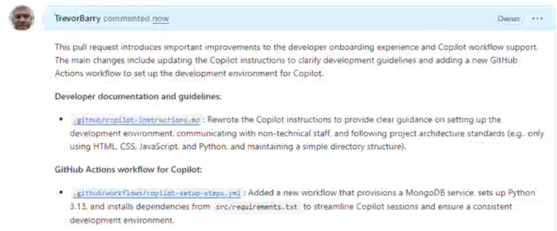

### Module 12 - Introduction to MCP Server

* There is a GitHub MCP Server that can be integrated wtih agents through GitHub Copilot chat.
    * In the VS Code chat interface, we can create an issue in our own GitHub repository for any issues that exist with our code base.
        * For example, after doing the vulnerability assessment, we can ask GitHub copilot to create issues for each finding.
        * With the `GitHub MCP Server` (tool selection) the agent will be able to create issues directly on GitHub.
        * It won't need to actually determine how to create the issue, it would trigger the task through the MCP server (black box) to create the issues.

* The MCP server has a description indicating what it is, the tools it has, and what it can do.
    * The agent will then use the tools in the MCP server to execute the task.
* You can add MCP servers into your local VS Code IDE, so your agent has access to them.
* Whenever you introduce an MCP server into your workspace, you need to me very clear about the permissions it has.

* MCP Website - [www.modelcontextprotocol.io/docs/2026-07-28/getting-started/intro](https://modelcontextprotocol.io/docs/2026-07-28/getting-started/intro)

### Summary

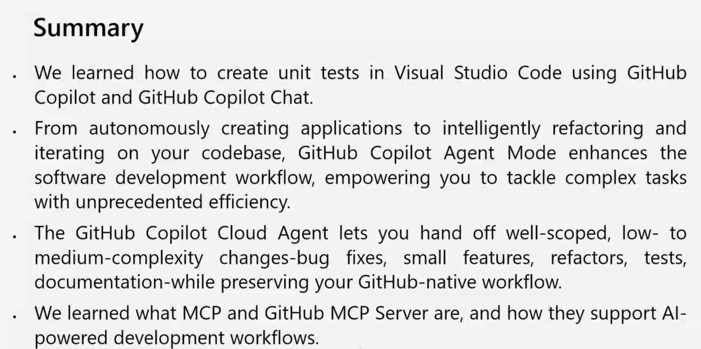

## Day 4 Session

### Module 13 - Introduction to Copilot Spaces

#### Creating your first space

* To create a space, go to https://github.com/copilot/spaces and create a space
* A GitHub space is a container in which you can have an interaction in copilot that is isolated from everything else going on.
    * You can attach things to that space that is relevant for copilot to use
    * Think of it like a meeting room for GitHub Copilot - a private session where no extraneous details are allowed in.
* We create a tightly focused copilot experience that will not pull in things from outside the space.
    * Prevents confusion with reasoning process with extraneous files, data, etc.
    * We prevent Copilot from accessing the web as well
* Once you've created the space, you can share this space with colleagues
    * Collectively you can asynchronously push forward the processes and objectives in that space

#### DEMO - GITHUB SPACES

* You provide instructions to define copilot's role, focus and what to avoid in the space
* Think of a space where you want to collaboratively work on a big design change with multiple individuals - we can tell the space that it is a software architect versed in design patterns and modern architecture practices, and that we are in the process of overhauling our existing software architecture.
    * We can add multiple sources like files, other repositories, links, etc.
* You can associate a repository to a space, give instructions to the agent to indicate that its role is to create pull request, provide a prompt to indicate what changes you want it to make, and then have it initiate a pull request to your original repository
    * You can bust out of your space by having copilot initiate an agent to perform a pull request to persist your work into the repository.

#### Sharing, Discoverability, and Governance

* Visibility and sharing
    * set visibility of space according to how broadly you intend others to use it
    * share space by link
* Security and access
    * follows GitHub's existing permissions
    * space does not grant new access, it only surfaces content that viewers are already entitled to see.
* Versioning and freshness
    * stay fresh by referencing live GitHub sources
    * Linked files reflect repo's default branch and attached issues, pull requests evolve as they change, reducing the need to copy content into separate docs
* Governance
    * Assign an owner, add a short "how to use this space" note at the top of the instructions
    * Establish naming convensions and review cadence to prune stale soruces and keep instructions aligned with reality
    * When space grows beyond single job, split into smaller Spaces

#### Do's and Don'ts of Working in a Space

 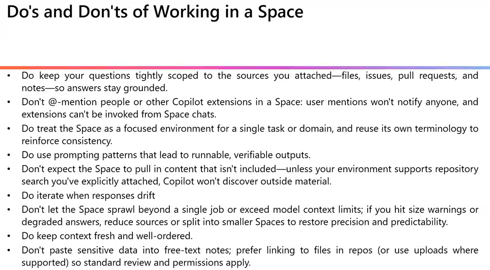

### Module 14 - Levelling up code reviews and pul requests with GitHub Copilot

#### DEMO - VS CODE AGENTS

* You can build a tailored agent for a particular project you a working on
    * You won't be wasting tokens helping a general purpose agent get to teh right answer
* You can build a custom agent inside VS Code - it opens a chat window in which you can introduce new capabilities.
    * you can keep the agent to your own workspace, or you can push the agent into your repository within the .github folder

    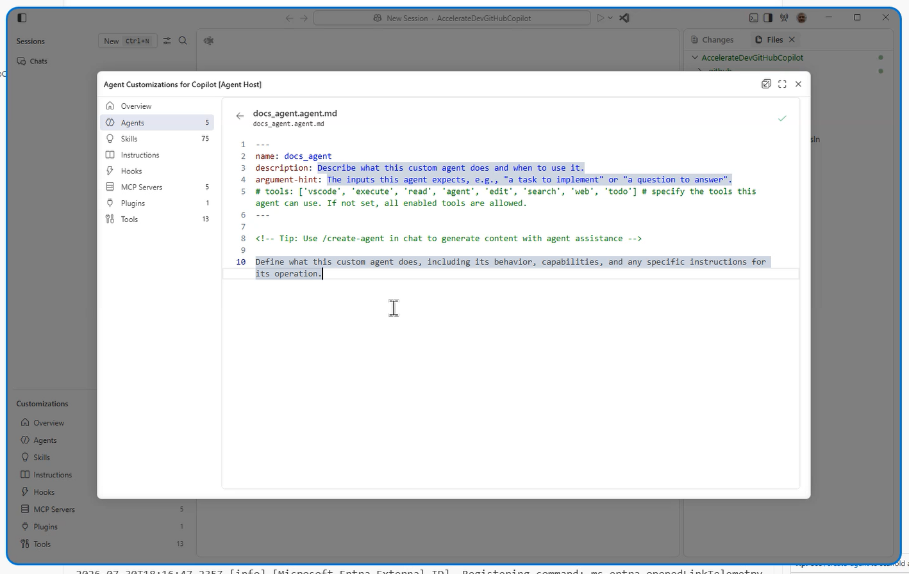

#### What GitHub Adds to Review Process

* You can use Copilot to augment the code in your repository, then ask Copilot to create a pull request, then ask Copilot to analyze the pull request (with possible human review), then you are done.
* Once you have your pull request, you add Copilot to the reviewers, which will analyze your code and identify any blockers that prevent the acceptance of the pull request
* We can create a file called copilot-instruction.md, which we add into a specific location in our GitHub repository, that Copilot will pick up whenever it does anything within that repository.
    * For individual it is at the repo level
    * For organizations / enterprises, you can set them consistently across repositories
        * We get the ability to set global standards across our organization
        * Helps create coding standards for example.
    * In plain English, you can specify several instructions to your Copilot agent

    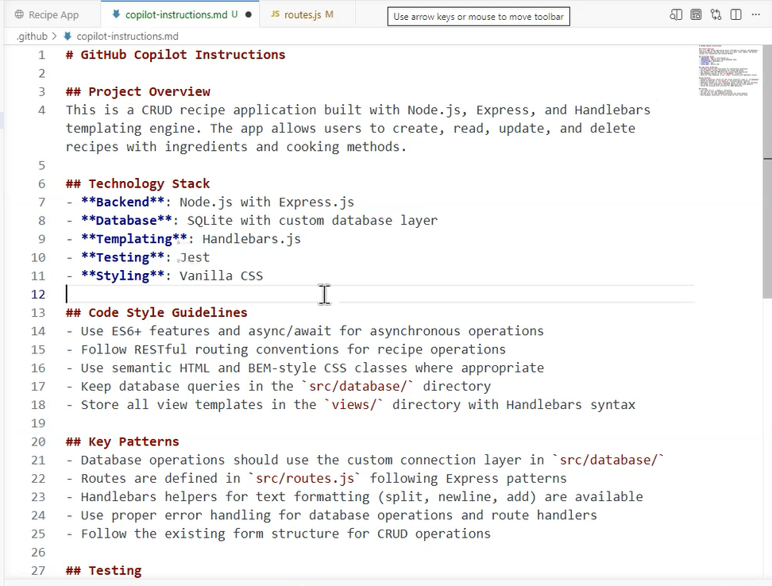

#### GitHub Copilot Instructions

* In the .github folder, you can create a new folder called "instructions", within which you can create various markdown files indicating different instruction files
    * You can put in extra instructions and apply filters to specify which files the instructions should target

    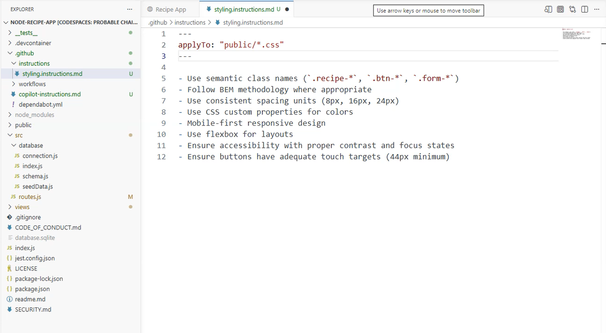

* Github Custom Instructions Repository

    * Instructions Repo - https://docs.github.com/en/copilot/tutorials/customization-library/custom-instructions

### Module 15 - Using GitHub Copilot with Javascript

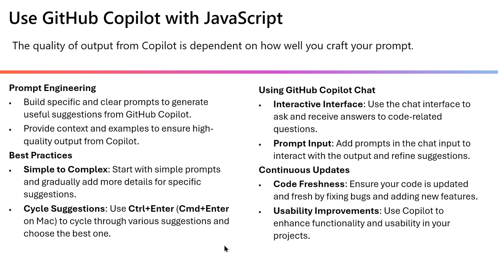

### DEMO - COPILOT IN JAVASCRIPT

* You can ask GitHub Copilot within VS Code to explain javascript code within a js file.
* You can accept in line suggestions while you edit your JS code
* We can ask the agent to create tests for us as well

### Module 16 - Using GitHub Copilot with Python

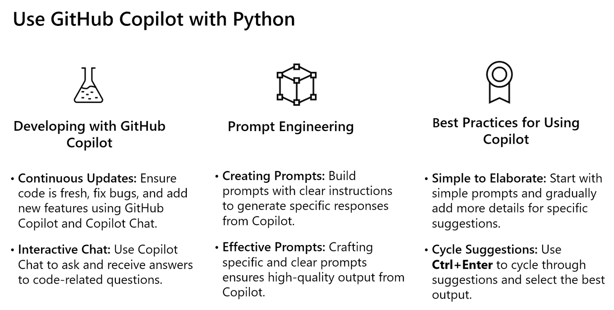

### Day 4 Homework

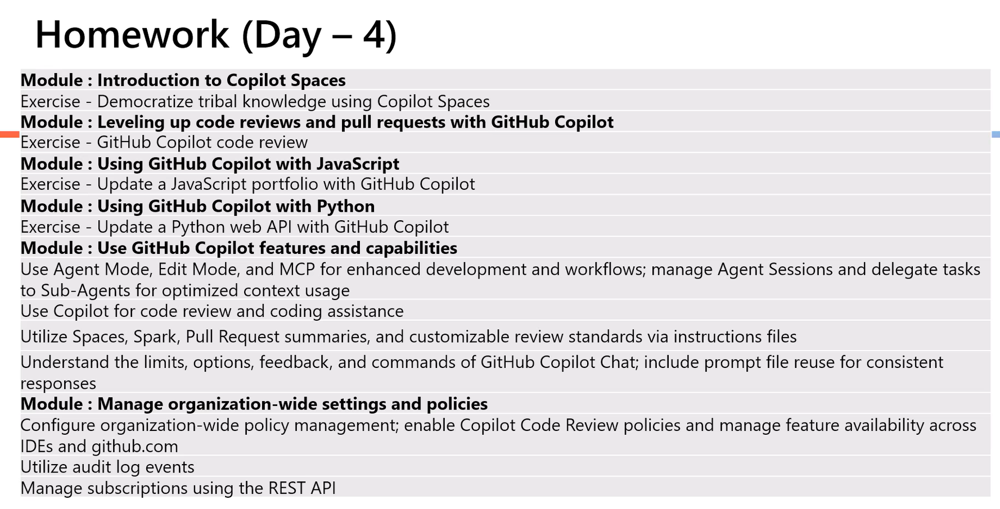